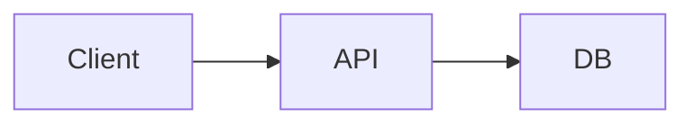

# Architecture: [System Name]

> **Status:** Active
> **Index:** [Back to README](./README.md)

## 1. Overview
*   **Purpose:** [Why does this exist?]
*   **Owner:** [Team/Person]

---

## 2. High-Level Design

---

## 3. Sharded Documentation
*See sub-documents for details:*

| Document | content |
|----------|---------|
| [**API Spec**](./api-specification.md) | Endpoints, Request/Response, Auth |
| [**Implementation**](./implementation-guide.md) | Code patterns, directory structure |
| [**Data Model**](./data-model.md) | ER Diagrams, Schemas, Migrations |
| [**Operations**](./operations.md) | Logging, Metrics, Alerts, Runbooks |
| [**Integration**](./integration.md) | External APIs, Webhooks, Events |

---

## 4. Key Constraints
*   **Scalability:** Must handle X RPM.
*   **Latency:** p99 < 200ms.
*   **Security:** HIPAA / GDPR Compliance.

---

## 5. Technology Stack
*   **Language:** ...
*   **Database:** ...
*   **Infrastructure:** ...
