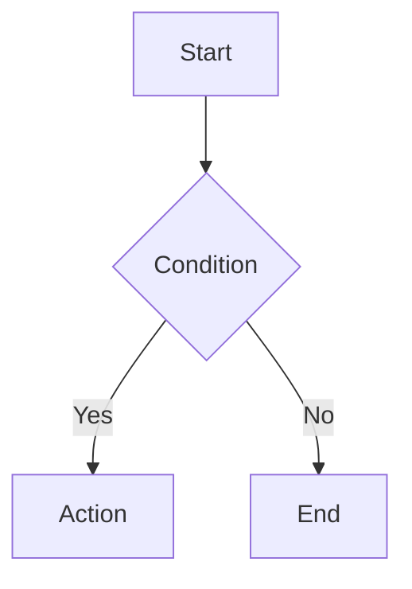

# [AMTCZ-ID] Technical Design: [Feature Name]

> **Status:** Draft / In Review / Approved
> **Date:** YYYY-MM-DD
> **Author:** Amatsucozy
> **Related Issue:** [Link]

---

## 1. Executive Summary

### 1.1 Problem Statement
*What is broken or missing? Why is this important?*

### 1.2 Proposed Solution
*High-level architectural approach.*

---

## 2. Discovery & Context (MANDATORY)

### 2.1 Existing Code Analysis
*Evidence from `grep_search`.*
- **Current Pattern:** `path/to/existing_file.ts` - describes how it works now.
- **Dependencies:** List critical imports/libraries.

### 2.2 Database Impact
*Will this change the schema?*
- [ ] No DB changes.
- [ ] New Table / Column: `[Details]`

### 2.3 Security Implications
*AuthN / AuthZ / Data Privacy*
- [ ] No security impact.
- [ ] Requires new permissions.
- [ ] Handles PII/sensitive data.

---

## 3. Technical Architecture

### 3.1 Logical Flow

### 3.2 Component Changes (The "What")

| File Path | Change | Description |
|-----------|--------|-------------|
| `/src/api/routes.ts` | Modify | Add `/new-endpoint` |
| `/src/core/logic.ts` | New | Implement `LogicClass` |

### 3.3 API Contract (If applicable)
*   **POST** `/path`
*   **Body:** `{ "key": "value" }`

---

## 4. Design Decisions

### 4.1 Rationale
*Why this approach?*

### 4.2 Alternatives Considered
*Why NOT the other way?*

### 4.3 Risks & Mitigations
*   **Risk:** Performance on large datasets.
*   **Mitigation:** Paginate API results.

---

## 5. Strategy
*   **Phase 1:** ...
*   **Phase 2:** ...
